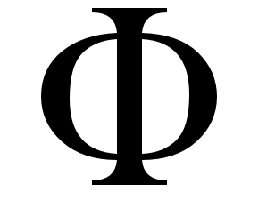
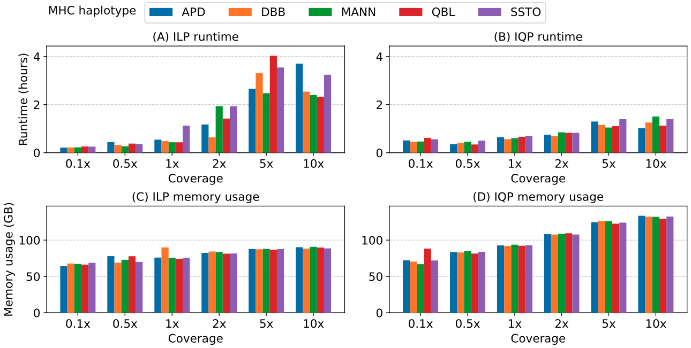

<div align="center">
  
</div>

## <div align="center"><span style="color:red;"><b>PHI</b></span> (<span style="color:red;"><b>P</b></span>angenome-based <span style="color:red;"><b>H</b></span>aplotype <span style="color:red;"><b>I</b></span>nference)</div>


## <a name="started"></a>Getting Started

### Prerequisites

#### Before using PHI, ensure you have the following dependencies installed:

1. **GCC 9 or later** - [GCC](https://gcc.gnu.org/)
2. **Zlib** - [zlib](https://zlib.net/)
3. **Gurobi** - [Gurobi](https://www.gurobi.com)
4. **VG Toolkit** - [vg](https://github.com/vgteam/vg)
5. **GBWTGraph** - [gfa2gbwt](https://github.com/jltsiren/gbwtgraph)

### Get PHI

```bash
git clone https://github.com/at-cg/PHI
cd PHI
# Install dependencies (anaconda is required)
./Installdeps
export PATH="extra/bin:$PATH"
export LD_LIBRARY_PATH="extra/lib:$LD_LIBRARY_PATH"
make

# test run with IQP (default)
./PHI -t32 -g test/MHC_4.gfa.gz -r test/CHM13_reads.fq.gz -o CHM13.fa

# test run with ILP
./PHI -t32 -q0 -g test/MHC_4.gfa.gz -r test/CHM13_reads.fq.gz -o CHM13.fa

# test run with vcf and reference
./vcf2gfa.py -v test/MHC_4.vcf.gz -r test/MHC-CHM13.0.fa.gz > test/MHC_4_vcf.gfa
./PHI -t32 -g test/MHC_4_vcf.gfa -r test/CHM13_reads.fq.gz -o CHM13.fa
```

#### Adding Binary and Library Paths to `.bashrc`
To ensure that the `extra/bin` and `extra/lib` directories are automatically loaded for every terminal session, you can export them to your `~/.bashrc`. This will make sure the required binaries and libraries for `PHI` are available.

```bash
# Add extra/bin and extra/lib to .bashrc
export PATH="extra/bin:$PATH" >> ~/.bashrc
export LD_LIBRARY_PATH="extra/lib:$LD_LIBRARY_PATH" >> ~/.bashrc
source ~/.bashrc
```

## Description
PHI is a tool designed to reconstruct haploid haplotypes from low-coverage short reads using a haplotype-aware pangenome graph represented as a Directed Acyclic Graph (DAG). Additionally, a VCF file and a reference genome against which the VCF was built can be used with the script `vcf2gfa.py` to generate a pangenome graph as input. PHI uses short reads to reconstruct haploid haplotypes through two methods:

1. **Integer Linear Programming (ILP)**: Enabled by passing the `-q0` flag, this uses an ILP-based formulation with relaxation of binary variables in continous domain.
2. **Integer Quadratic Programming (IQP)**: Enabled by passing the `-q1` flag, this is the default method and uses an IQP-based formulation with relaxation of binary variables in continous domain.

The details of these formulations are described in our [paper](#publications).

## Results
We benchmarked PHI (v1.0) using real illumina reads from 5 MHC haplotypes APD, DBB, MANN, QBL and SSTO, downsampled to various coverages (0.1x - 18.2x). We benchmark the runtime of the ILP and IQP based formulations and the results shows that the IQP runs faster as compated to ILP, but requires approx 1.5x memory. The scripts to reproduce the results are available [here](data).

<p align="center" id="F1-score">
    
</p>

> Edit distance between ground-truth and imputed MHC haplotypes generated
from real Illumina reads at various sequencing coverages (0.1x to total coverage) using different tools (PHI, VG and PanGenie).

<p align="center" id="F1-score">
    
</p>

> Performance comparison between ILP and IQP, illustrating runtime and memory usage across varying
coverage levels and haplotypes.

## Future Work
1. We plan to add support for diploid haplotype reconstruction.

## Publications
(To be added)